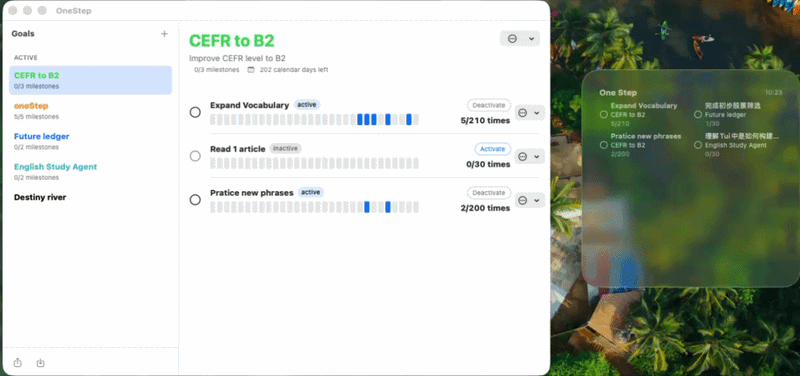

# One Step

Daily planning, one tap at a time.

<p align="center">
  
</p>

One Step is a quiet, local-first macOS app for tracking regular goals and routines through desktop Widgets. Create a long-term goal, break it into active milestones, and check off today's progress from the Widget or the main app without turning the day into a task-management ritual.

## Why One Step Exists

I built One Step because I wanted a simple place to record regular goals and routines: the things I want to keep showing up for, one day at a time.

Most goal, habit, and productivity apps eventually grow into something broader than that. They add feeds, reminders, dashboards, gamification, collaboration, categories, projects, and a dozen other features that may be useful somewhere, but are unrelated to the basic act of recording steady progress. One Step is intentionally smaller. It exists to answer one question quickly: did I make progress on this goal today?

## Current Status

One Step v1 is a working local-first app and Widget:

- Create, edit, reorder, archive/reactivate, and delete long-term goals.
- Add ordered milestones inside each goal, then activate one or more incomplete milestones for daily check-ins.
- Use finite milestone targets that auto-complete, or unlimited milestones that stay open until you decide they are done.
- Complete today's milestone from the main app or directly from the Widget via AppIntent.
- Undo today's completion in the main app, including reopening an auto-completed milestone when needed.
- Review recent completion activity for each milestone.
- Export and import local `.onestepbackup` files for data portability.
- Share SwiftData storage between the app and Widget through the App Group container.

## How It Works

1. **Set a final goal.** Give the long-term goal a title, optional description, optional calendar-day limit, and color theme.
2. **Break it into milestones.** Add sequential phases with optional completion targets. Leave the target empty for an unlimited milestone.
3. **Choose what is active.** Only active, incomplete milestones appear in check-in flows. A goal can have more than one active milestone.
4. **Check in daily.** Tap a milestone in the Widget or mark it complete in the app. Repeated same-day taps are idempotent.
5. **Stay honest.** Missed days stay missed. No streak repair, no guilt mechanics, no social feed.

## Widget Sizes

| Size | Visible Active Milestones | Layout |
|------|---------------------------|--------|
| Small | Up to 2 | Single column |
| Medium | Up to 4 | Two-column grid |
| Large | Up to 12 | Two-column grid |

Each row shows the active milestone, its parent goal, today's completion state, and completion progress. Widget ordering follows the app's manual goal order, then milestone order. Widgets refresh on a 15-minute timeline and request a reload after Widget check-ins; exact refresh timing is still controlled by macOS.

## Goals and Milestones

One Step uses a two-level model:

- **Final goals** are the long-term aspirations. They can have descriptions, calendar-day limits, color themes, manual sort order, and archived state.
- **Milestones** are ordered phases under a final goal. They can have a finite target completion count or no target at all.

Only active incomplete milestones can receive check-ins. When a finite milestone reaches its target, it auto-completes and becomes inactive. Unlimited milestones keep counting completions without auto-completing.

Archived goals stay in the app for history, but their milestones are removed from Widget visibility and cannot be completed from stale Widget taps.

## Data Backup

One Step can export all local data from the Goals sidebar bottom toolbar:

- Choose **Export Data...** to save a `.onestepbackup` JSON file containing goals, milestones, archived state, and completion history.
- Choose **Import Data...** to restore a backup. Import replaces all current local data after confirmation.
- Keep exported backup files somewhere private because they contain your goal names, notes, and completion history.

## Architecture

```text
OneStep/            macOS SwiftUI app
OneStepWidget/      WidgetKit extension and AppIntent check-in flow
Packages/
  OneStepCore/      shared Swift package for SwiftData models, repositories,
                    snapshots, backup documents, date handling, and logging
```

The app and Widget both depend on `OneStepCore`. Persistence rules live in repository types rather than SwiftUI views or Widget code. The shared store lives in the App Group container `group.dev.dynnfa.OneStep`.

## Requirements

- macOS 14+
- Xcode 15+
- Swift 5.9+

## Build

```bash
swift test --package-path Packages/OneStepCore
xcodebuild -project OneStep.xcodeproj -scheme OneStep -destination 'platform=macOS' build
```

To run the app-level XCTest suite:

```bash
xcodebuild -project OneStep.xcodeproj -scheme OneStep -destination 'platform=macOS' test
```

## Verify the Widget

1. Run the `OneStep` scheme.
2. Create several goals with active milestones.
3. Add One Step Widget in small, medium, and large sizes.
4. Tap an incomplete active milestone in the Widget.
5. Confirm it marks as completed without opening the app.
6. Archive a goal in the app and confirm its milestones disappear from future Widget timelines.

## What One Step Is Not

Not a task manager. Not a streak app. Not a notes tool. Not a social habit tracker. Not a dashboard that asks for more attention than the goal itself. One thing only: show up, tap, move on.

## Data

All data lives locally in SwiftData inside the app group container `group.dev.dynnfa.OneStep`. No accounts, no analytics, no telemetry. Import/export uses local JSON backup files; iCloud sync is a possible v2 direction.

## Documentation

- [Roadmap](ROADMAP.md)
- [Contributing](CONTRIBUTING.md)
- [Privacy](PRIVACY.md)
- [V1 Product Spec](docs/product/v1-product-spec.md)
- [Architecture](docs/engineering/architecture.md)
- [Data Schema & Migration](docs/engineering/data-schema-and-migration.md)
- [Release Checklist](docs/qa/release-checklist.md)
- [Widget Troubleshooting](docs/troubleshooting/widget-app-group.md)
